<div align="center">


# Summonlab

**A hero-summoning game where every hero is an autonomous agent.**

</div>

Summon heroes, build a home around them, prepare parties, and climb a randomized
one-hundred-floor tower. Heroes develop through experience, relationships, habits, training, and
the systems the player creates around them.

## Home


*Village screenshot from the prototype.*

The Hearth is where summoned heroes become neighbors. The Residence offers a place to rest and share
meals. The Training Grounds give practice a rhythm. The Forge turns preparation into something a hero
can carry. The Summoning Circle brings someone new into a town that already has a history.

The vision is a settlement that keeps living between expeditions: work, friendships, rivalries,
mentorship, and habits. Your choices shape the conditions around those lives. A building matters
because it changes what people can do and whom they meet.

## Heroes

<table>
  <tr>
    <td align="center" width="25%">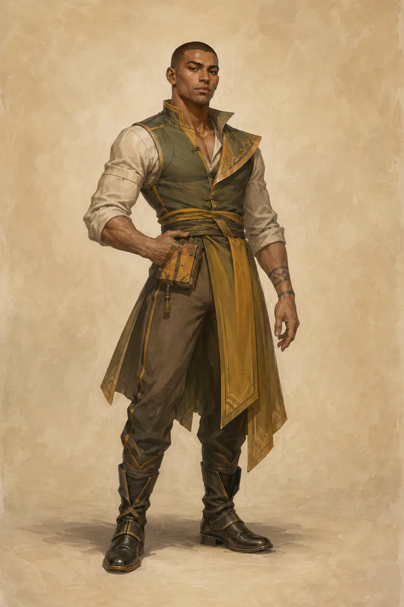<br><strong>Meiis Eshel</strong></td>
    <td align="center" width="25%">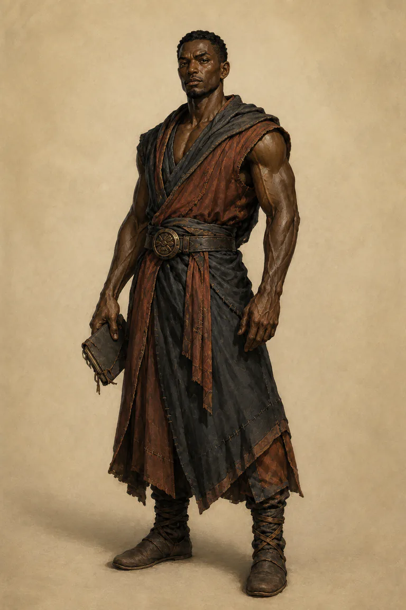<br><strong>Zelyn Eshun</strong></td>
    <td align="center" width="25%">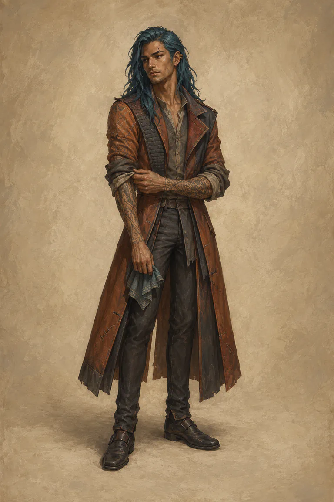<br><strong>Belia Corin</strong></td>
    <td align="center" width="25%">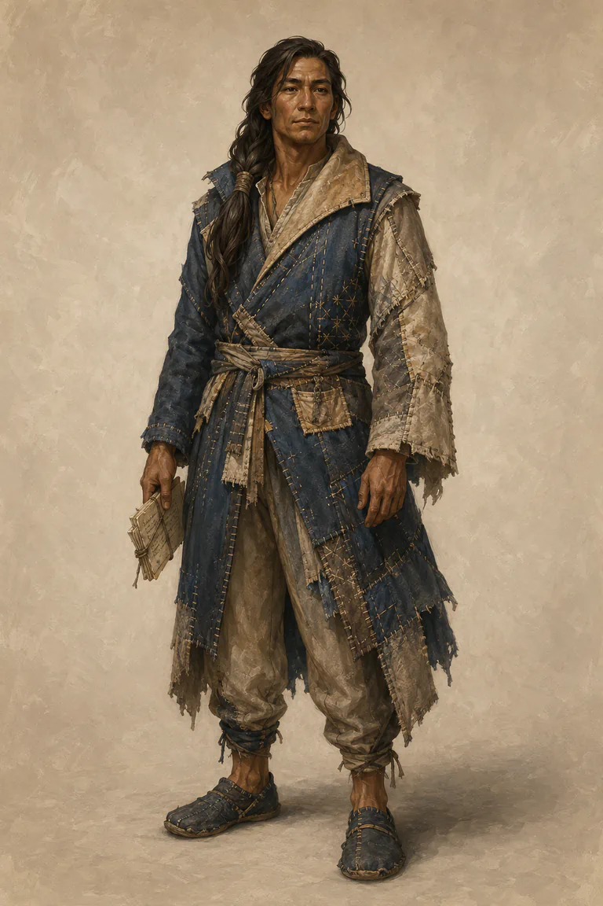<br><strong>Calon Vesha</strong></td>
  </tr>
  <tr>
    <td align="center" width="25%">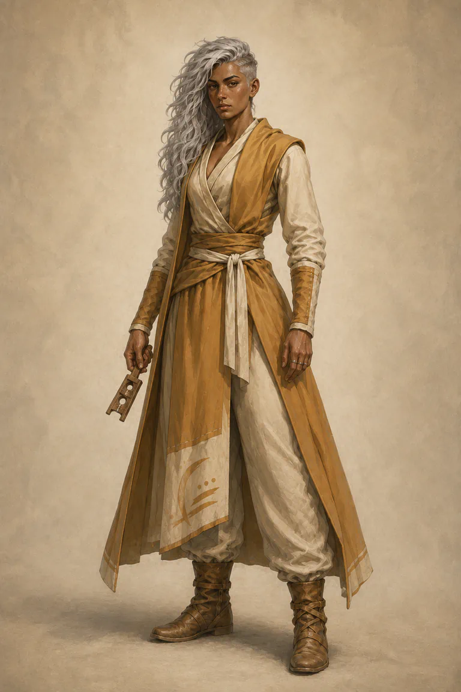<br><strong>Peria Halo</strong></td>
    <td align="center" width="25%">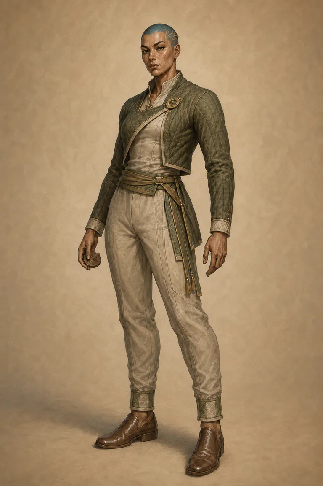<br><strong>Lorar Amaren</strong></td>
    <td align="center" width="25%">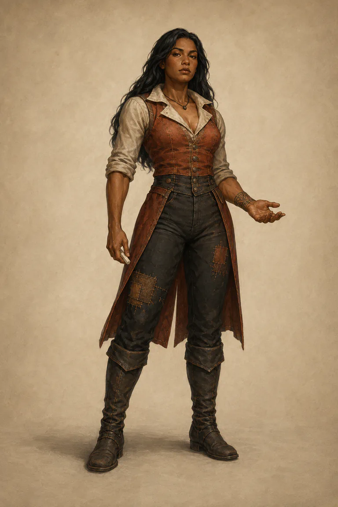<br><strong>Delyn Nethai</strong></td>
    <td align="center" width="25%"><a href="https://media.githubusercontent.com/media/jmoraispk/summonlab/ae01c4f5578d260335442534f11fda8b2a0ba615/assets/heroes/experiments/one-star-overnight-200-001/waves/wave-04/candidates/brinia-ulenai/summon-v1.png">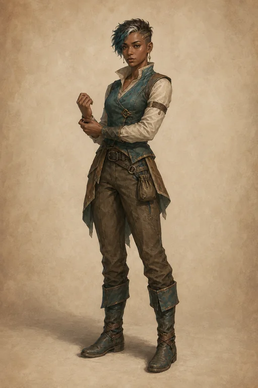</a><br><strong>Brinia Ulenai</strong></td>
  </tr>
</table>

A summon begins with a stranger. Learn who arrived: what they want, what they fear, whom they trust,
and where they might find purpose. You are the Master, the nonphysical presence guiding their
settlement. Heroes interpret your directions and make their own choices.

A quiet craftsperson, a patient teacher, and a capable fighter can each become essential to the town.
These eight portraits include seven from the [200 approved heroes](docs/readme-gallery/heroes.md)
and Brinia Ulenai from the historical collection. The [complete visual archive](docs/readme-gallery/hero-archive.md)
also includes earlier studies and combat prototypes.

### Combat prototypes

<table>
  <tr>
    <td align="center" width="33%"><a href="apps/web/static/runtime/combat/realtime-study-v1/hero-saffron-braid-ready-v1.png">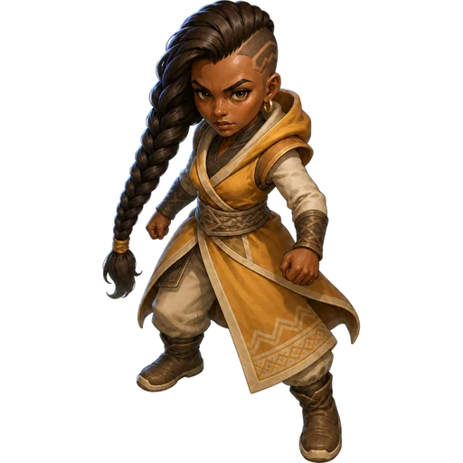</a><br><strong>Asha</strong></td>
    <td align="center" width="33%"><a href="apps/web/static/runtime/combat/realtime-study-v1/hero-moss-archer-ready-v1.png">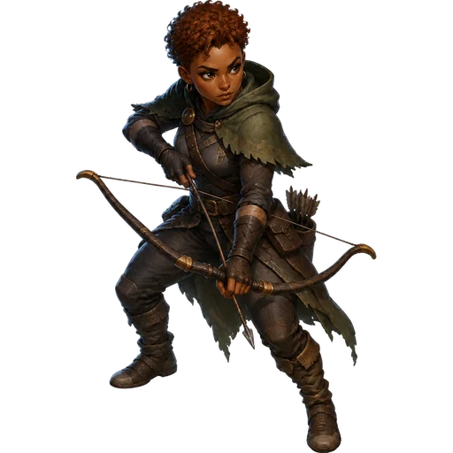</a><br><strong>Nessa</strong></td>
    <td align="center" width="33%"><a href="apps/web/static/runtime/combat/realtime-study-v1/hero-iron-guardian-ready-v1.png">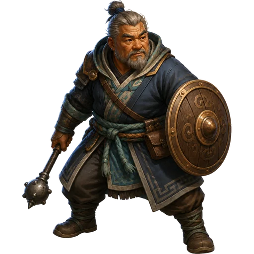</a><br><strong>Toma</strong></td>
  </tr>
</table>

*Early combat prototypes. Select a character to see the full-size original.*

### Legacy portraits

<table>
  <tr>
    <td align="center" width="25%"><a href="assets/heroes/visuals/realtime-combat-study-v1/saffron-braid-source-v1.png">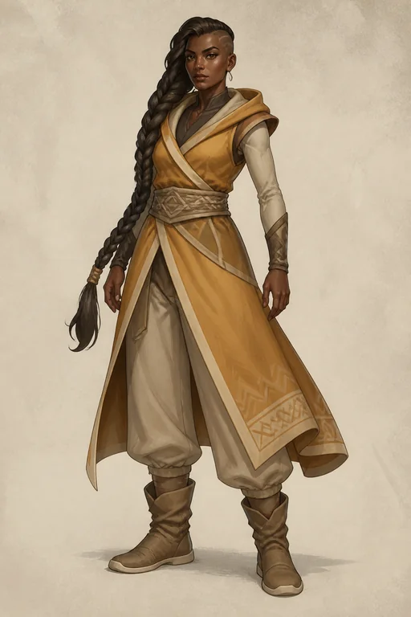</a></td>
    <td align="center" width="25%"><a href="docs/readme-gallery/legacy-pack/bearded-villager.png">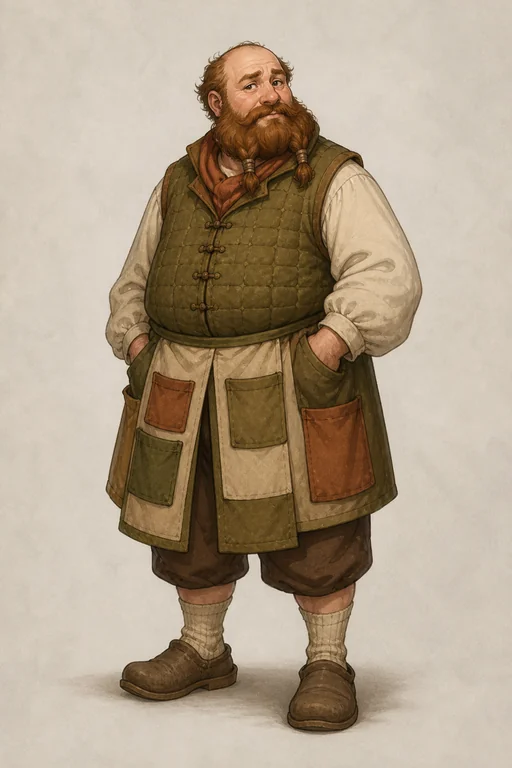</a></td>
    <td align="center" width="25%"><a href="docs/readme-gallery/legacy-pack/blue-robed-hero.png">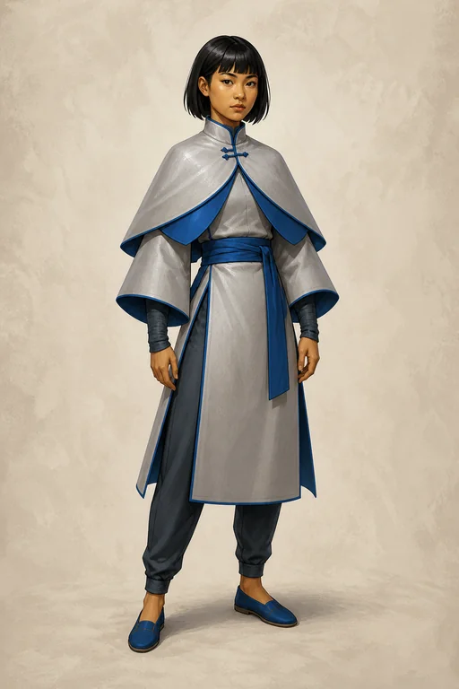</a></td>
    <td align="center" width="25%"><a href="docs/readme-gallery/legacy-pack/burgundy-coated-hero.png">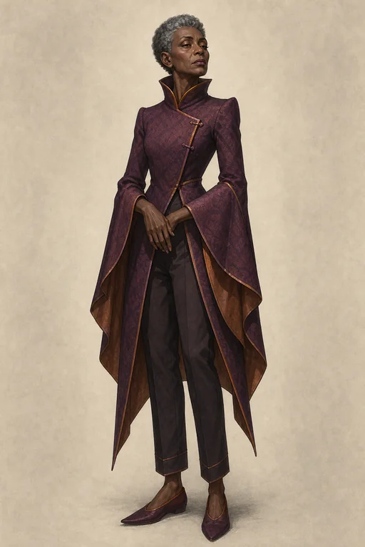</a></td>
  </tr>
</table>

*Earlier character artwork, selected for the legacy pack. Select a portrait to see the full-size original.*

## Enemies

<table>
  <thead><tr><th>Family</th><th>T1 · Initiate</th><th>T2 · Soldier</th><th>T4 · Champion</th></tr></thead>
  <tbody>
    <tr><th scope="row">Goblins</th>
      <td align="center"><a href="assets/enemies/experiments/family-affinity-v1/candidates/goblins/goblin-runt/normal-v1.png">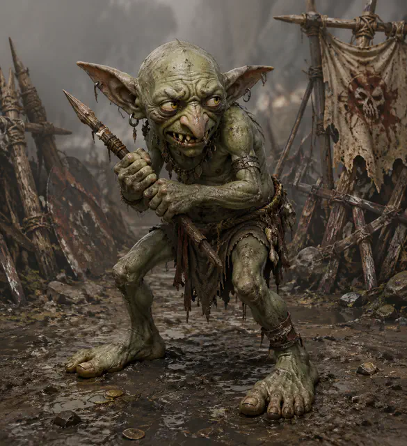</a><br><strong>Runt</strong></td>
      <td align="center"><a href="assets/enemies/experiments/family-affinity-v1/candidates/goblins/goblin-cutter/normal-v1.png">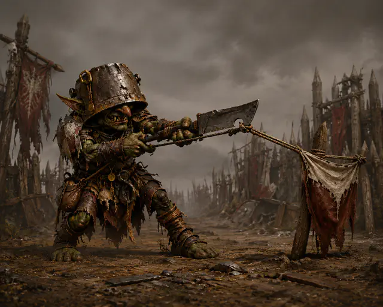</a><br><strong>Cutter</strong></td>
      <td align="center"><a href="assets/enemies/experiments/family-affinity-v1/candidates/goblins/goblin-warboss/normal-v1.png">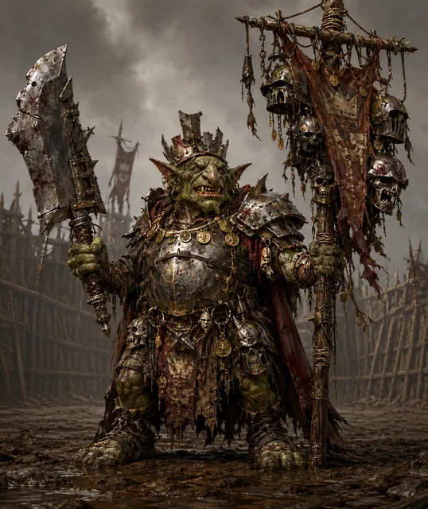</a><br><strong>Warboss</strong></td>
    </tr>
    <tr><th scope="row">Skeletons</th>
      <td align="center"><a href="assets/enemies/experiments/family-affinity-v1/candidates/skeletons/skeleton-rattler/normal-v1.png">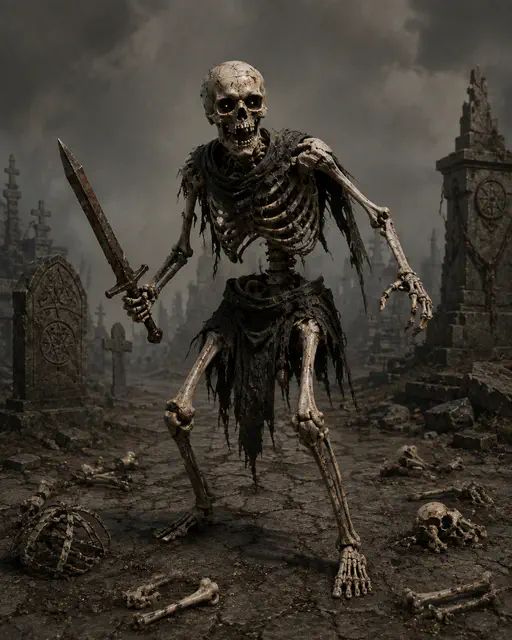</a><br><strong>Rattler</strong></td>
      <td align="center"><a href="assets/enemies/experiments/family-affinity-v1/candidates/skeletons/skeleton-bonesoldier/normal-v1.png">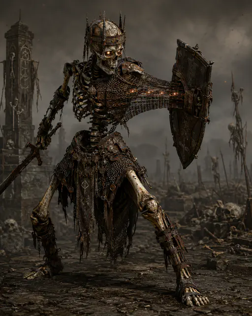</a><br><strong>Bonesoldier</strong></td>
      <td align="center"><a href="assets/enemies/experiments/family-affinity-v1/candidates/skeletons/skeleton-bone-champion/normal-v1.png">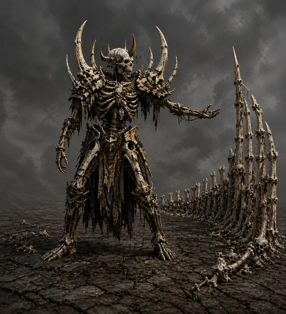</a><br><strong>Bone Champion</strong></td>
    </tr>
    <tr><th scope="row">Dragons</th>
      <td align="center"><a href="assets/enemies/experiments/family-affinity-v1/candidates/dragons/dragon-whelp/normal-v1.png">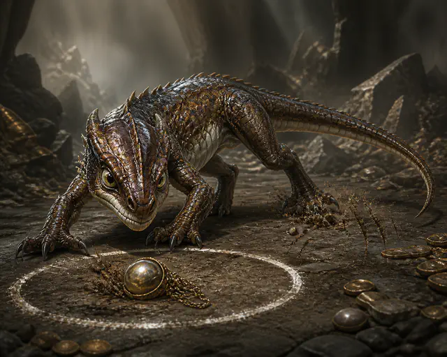</a><br><strong>Whelp</strong></td>
      <td align="center"><a href="assets/enemies/experiments/family-affinity-v1/candidates/dragons/dragon-fledgling/normal-v1.png">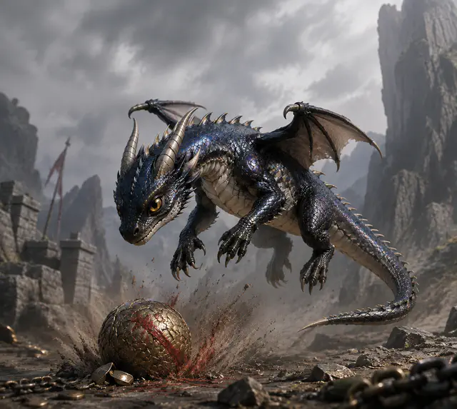</a><br><strong>Fledgling</strong></td>
      <td align="center"><a href="assets/enemies/experiments/family-affinity-v1/candidates/dragons/dragon-elder-wyrm/normal-v1.png">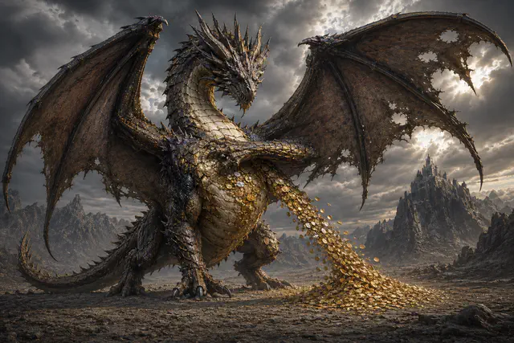</a><br><strong>Elder Wyrm</strong></td>
    </tr>
    <tr><th scope="row">Elementals</th>
      <td align="center"><a href="assets/enemies/experiments/family-affinity-v1/candidates/elementals/elemental-wisp/normal-v1.png">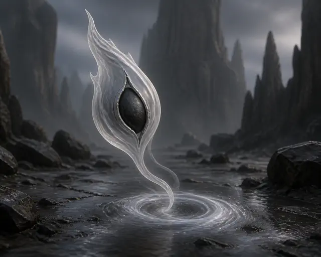</a><br><strong>Wisp</strong></td>
      <td align="center"><a href="assets/enemies/experiments/family-affinity-v1/candidates/elementals/elemental-spirit/normal-v1.png">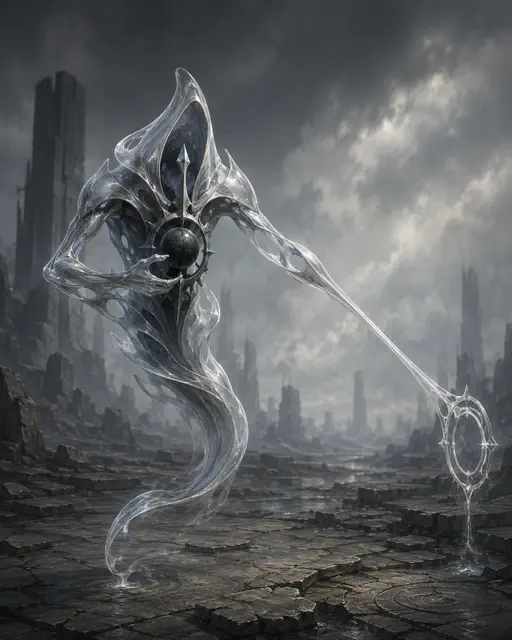</a><br><strong>Elemental Spirit</strong></td>
      <td align="center"><a href="assets/enemies/experiments/family-affinity-v1/candidates/elementals/elemental-colossus/normal-v1.png">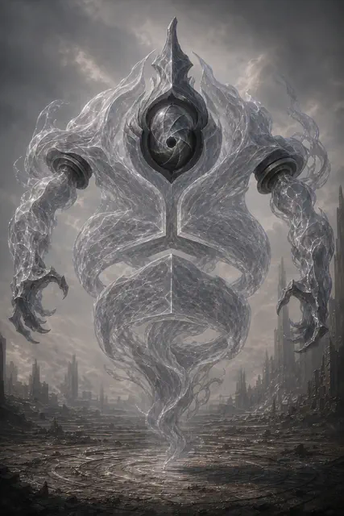</a><br><strong>Elemental Colossus</strong></td>
    </tr>
    <tr><th scope="row">Golems</th>
      <td align="center"><a href="assets/enemies/experiments/family-affinity-v1/candidates/golems/golem-clay-figure/normal-v1.png">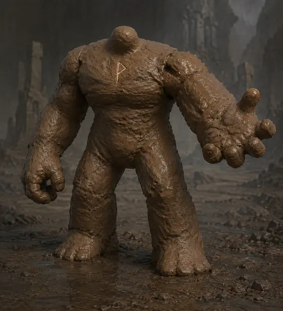</a><br><strong>Clay Figure</strong></td>
      <td align="center"><a href="assets/enemies/experiments/family-affinity-v1/candidates/golems/golem-stone-servant/normal-v1.png">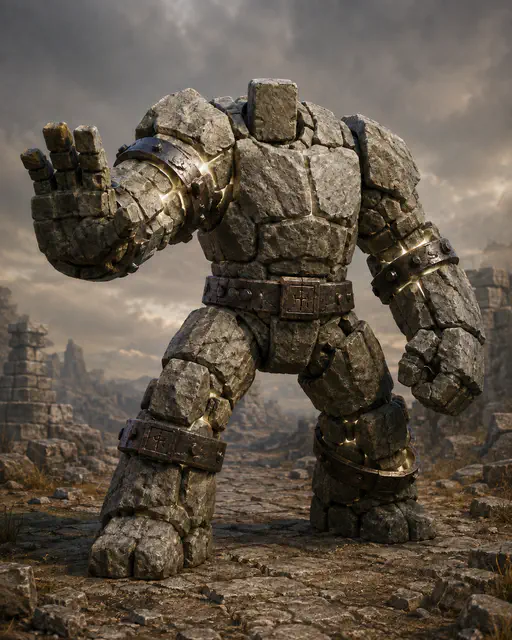</a><br><strong>Stone Servant</strong></td>
      <td align="center"><a href="assets/enemies/experiments/family-affinity-v1/candidates/golems/golem-basalt-colossus/normal-v1.png">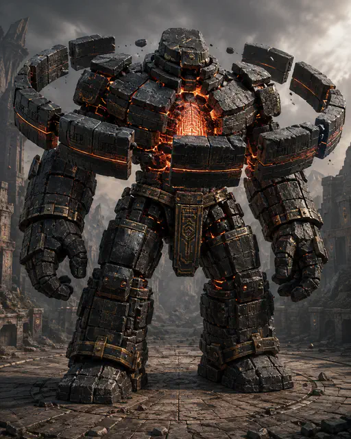</a><br><strong>Basalt Colossus</strong></td>
    </tr>
  </tbody>
</table>

*Select any image to open its full-size artwork.*

Beyond the Tower Portal lies a randomized one-hundred-floor campaign. Different monster families
bring distinct forms, battlefield roles, and elemental affinities. The selection above shows how
familiar threats can develop into very different challenges.

The climb is meant to test what a party has learned together. Reading a threat, covering a weakness,
and knowing when to retreat should matter alongside strength.

## Equipment

<table>
  <thead><tr><th>Set</th><th>Weapon</th><th>Head</th><th>Torso</th><th>Legs</th><th>Boots</th></tr></thead>
  <tbody>
    <tr><th colspan="6">Heavy armor</th></tr>
    <tr><th scope="row">Bronze<br>Rank F</th>
      <td align="center"><a href="assets/equipment/approved/material-equipment-v1/items/f/bronze/sword.png">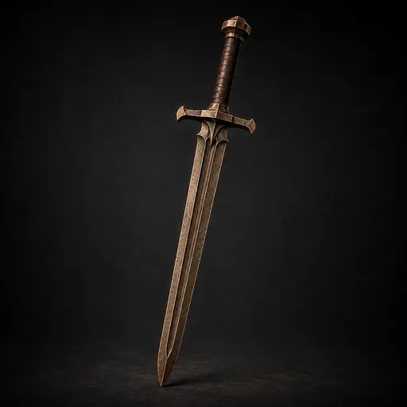</a><br>Bronze Sword</td>
      <td align="center"><a href="assets/equipment/approved/material-equipment-v1/items/f/bronze/heavy-armor-head.png">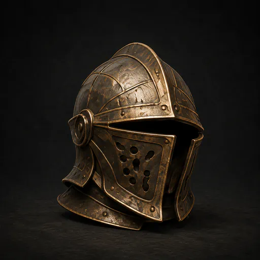</a></td>
      <td align="center"><a href="assets/equipment/approved/material-equipment-v1/items/f/bronze/heavy-armor-torso.png">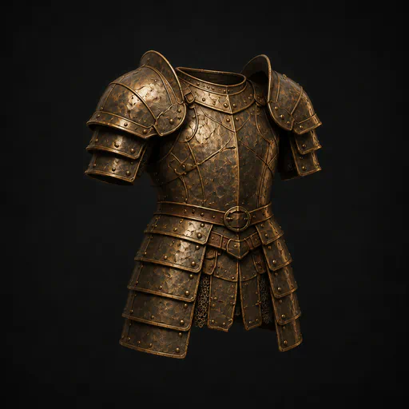</a></td>
      <td align="center"><a href="assets/equipment/approved/material-equipment-v1/items/f/bronze/heavy-armor-legs.png">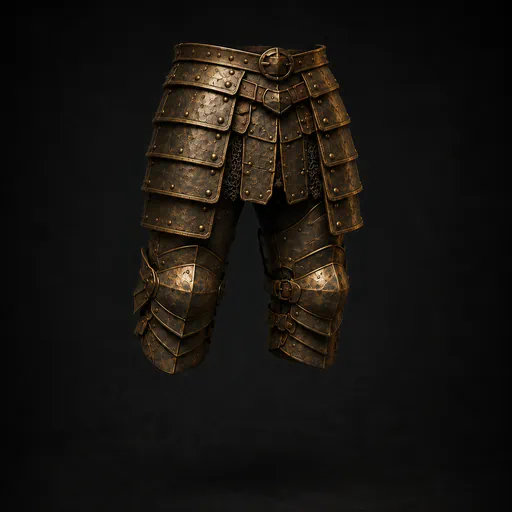</a></td>
      <td align="center"><a href="assets/equipment/approved/material-equipment-v1/items/f/bronze/heavy-armor-boots.png">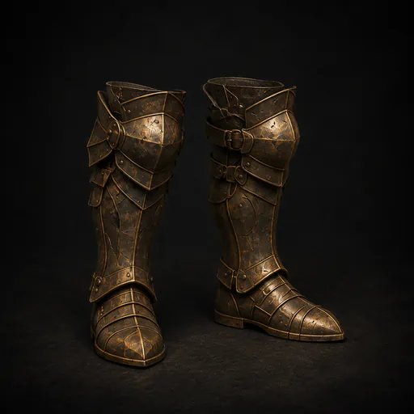</a></td>
    </tr>
    <tr><th scope="row">Steel<br>Rank D</th>
      <td align="center"><a href="assets/equipment/approved/material-equipment-v1/items/d/steel/sword.png">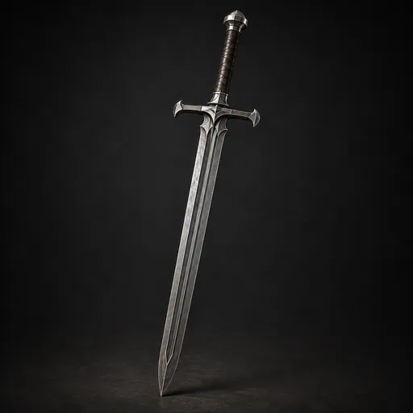</a><br>Steel Sword</td>
      <td align="center"><a href="assets/equipment/approved/material-equipment-v1/items/d/steel/heavy-armor-head.png">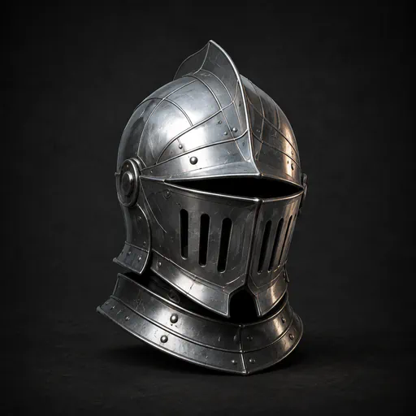</a></td>
      <td align="center"><a href="assets/equipment/approved/material-equipment-v1/items/d/steel/heavy-armor-torso.png">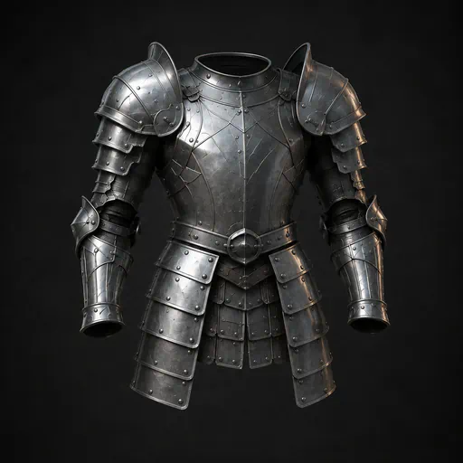</a></td>
      <td align="center"><a href="assets/equipment/approved/material-equipment-v1/items/d/steel/heavy-armor-legs.png">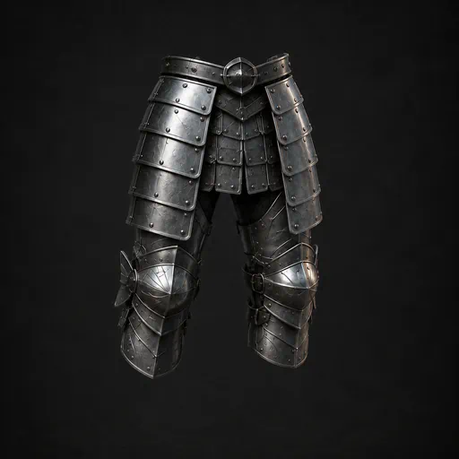</a></td>
      <td align="center"><a href="assets/equipment/approved/material-equipment-v1/items/d/steel/heavy-armor-boots.png">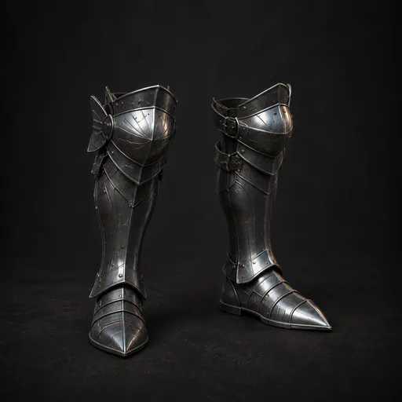</a></td>
    </tr>
    <tr><th scope="row">Sunsteel<br>Rank S</th>
      <td align="center"><a href="assets/equipment/approved/material-equipment-v1/items/s/sunsteel/sword.png">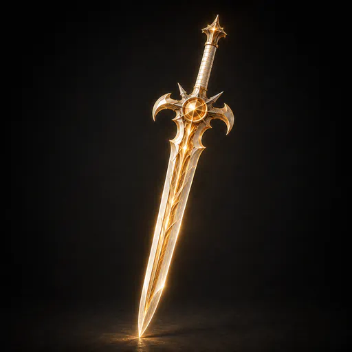</a><br>Sunsteel Sword</td>
      <td align="center"><a href="assets/equipment/approved/material-equipment-v1/items/s/sunsteel/heavy-armor-head.png">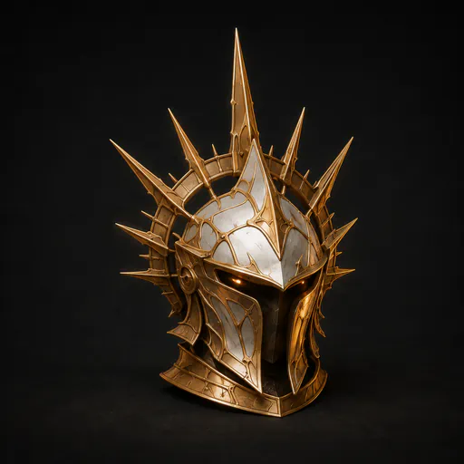</a></td>
      <td align="center"><a href="assets/equipment/approved/material-equipment-v1/items/s/sunsteel/heavy-armor-torso.png">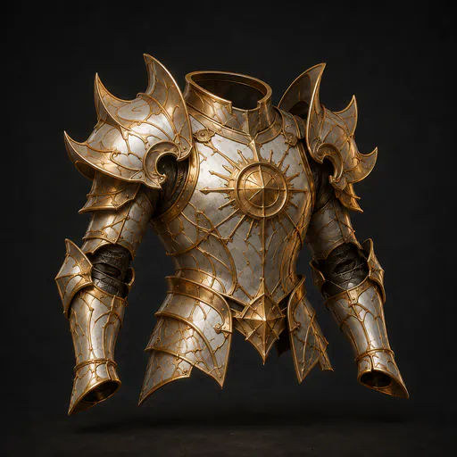</a></td>
      <td align="center"><a href="assets/equipment/approved/material-equipment-v1/items/s/sunsteel/heavy-armor-legs.png">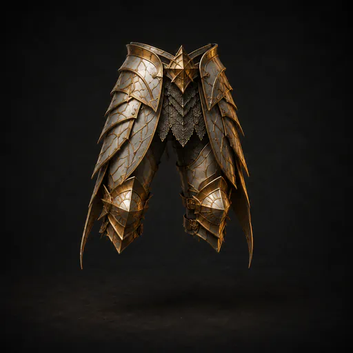</a></td>
      <td align="center"><a href="assets/equipment/approved/material-equipment-v1/items/s/sunsteel/heavy-armor-boots.png">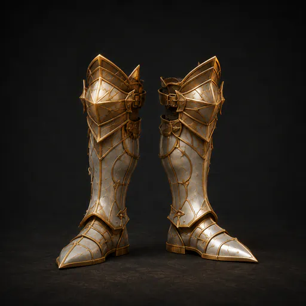</a></td>
    </tr>
    <tr><th colspan="6">Light armor</th></tr>
    <tr><th scope="row">Coarse Hide<br>Rank F</th>
      <td align="center"><a href="assets/equipment/approved/material-equipment-v1/items/f/ash/bow.png">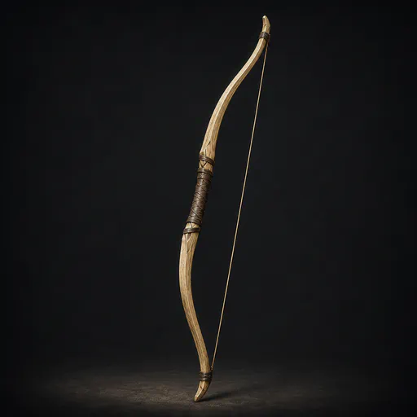</a><br>Ash Bow</td>
      <td align="center"><a href="assets/equipment/approved/material-equipment-v1/items/f/coarse-hide/light-armor-head.png">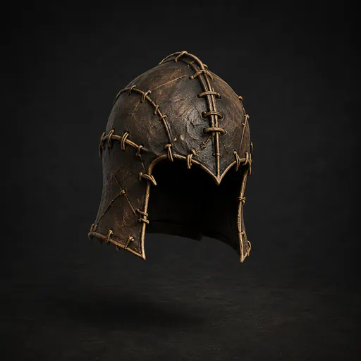</a></td>
      <td align="center"><a href="assets/equipment/approved/material-equipment-v1/items/f/coarse-hide/light-armor-torso.png">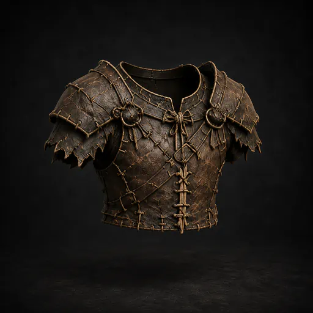</a></td>
      <td align="center"><a href="assets/equipment/approved/material-equipment-v1/items/f/coarse-hide/light-armor-legs.png">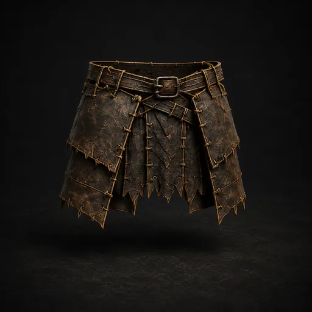</a></td>
      <td align="center"><a href="assets/equipment/approved/material-equipment-v1/items/f/coarse-hide/light-armor-boots.png">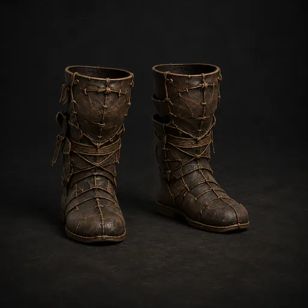</a></td>
    </tr>
    <tr><th scope="row">Beast Scale<br>Rank D</th>
      <td align="center"><a href="assets/equipment/approved/material-equipment-v1/items/d/ironwood/bow.png">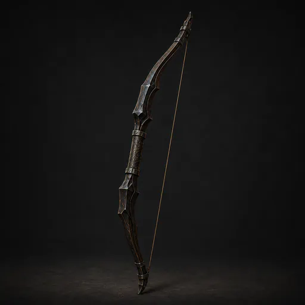</a><br>Ironwood Bow</td>
      <td align="center"><a href="assets/equipment/approved/material-equipment-v1/items/d/beast-scale/light-armor-head.png">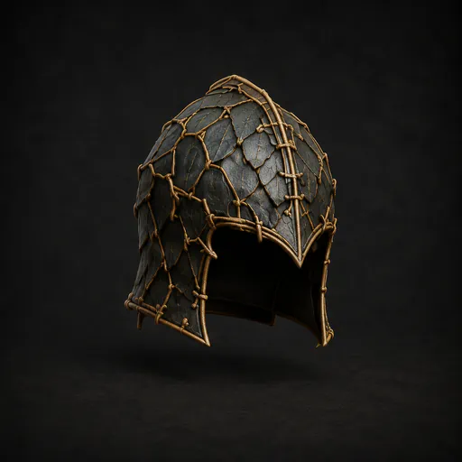</a></td>
      <td align="center"><a href="assets/equipment/approved/material-equipment-v1/items/d/beast-scale/light-armor-torso.png">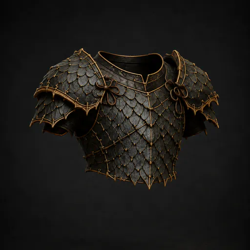</a></td>
      <td align="center"><a href="assets/equipment/approved/material-equipment-v1/items/d/beast-scale/light-armor-legs.png">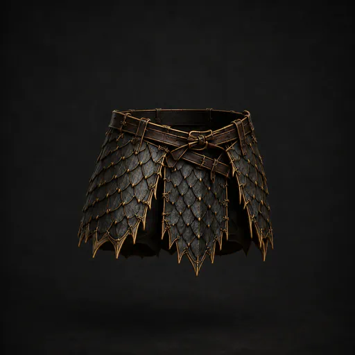</a></td>
      <td align="center"><a href="assets/equipment/approved/material-equipment-v1/items/d/beast-scale/light-armor-boots.png">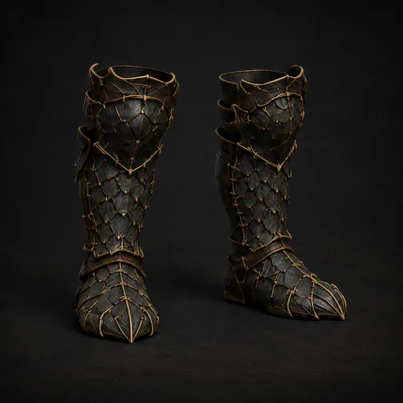</a></td>
    </tr>
    <tr><th scope="row">Ancient Dragon Scale<br>Rank S</th>
      <td align="center"><a href="assets/equipment/approved/material-equipment-v1/items/s/worldtree-limb/bow.png">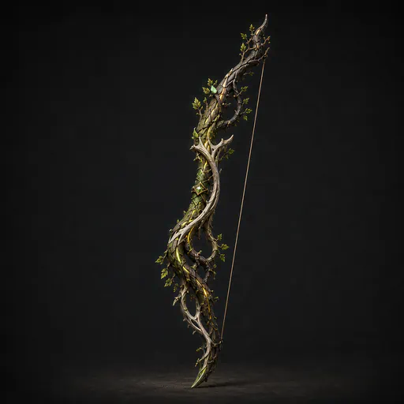</a><br>Worldtree Limb Bow</td>
      <td align="center"><a href="assets/equipment/approved/material-equipment-v1/items/s/ancient-dragon-scale/light-armor-head.png">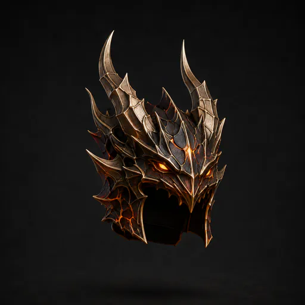</a></td>
      <td align="center"><a href="assets/equipment/approved/material-equipment-v1/items/s/ancient-dragon-scale/light-armor-torso.png">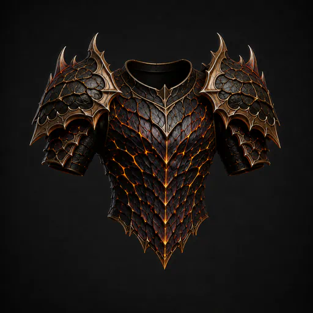</a></td>
      <td align="center"><a href="assets/equipment/approved/material-equipment-v1/items/s/ancient-dragon-scale/light-armor-legs.png">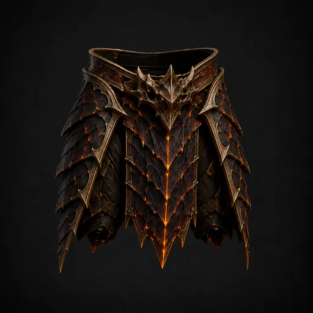</a></td>
      <td align="center"><a href="assets/equipment/approved/material-equipment-v1/items/s/ancient-dragon-scale/light-armor-boots.png">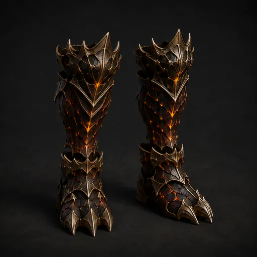</a></td>
    </tr>
    <tr><th colspan="6">Robes</th></tr>
    <tr><th scope="row">Hemp Weave<br>Rank F</th>
      <td align="center"><a href="assets/equipment/approved/material-equipment-v1/items/f/ash/staff.png">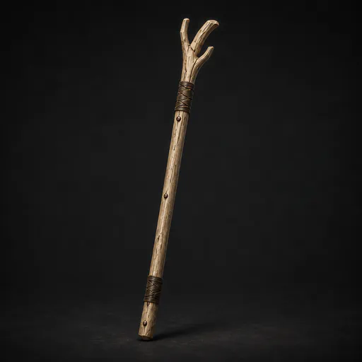</a><br>Ash Staff</td>
      <td align="center"><a href="assets/equipment/approved/material-equipment-v1/items/f/hemp-weave/robes-head.png">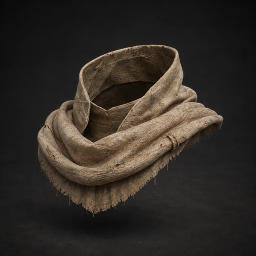</a></td>
      <td align="center"><a href="assets/equipment/approved/material-equipment-v1/items/f/hemp-weave/robes-torso.png">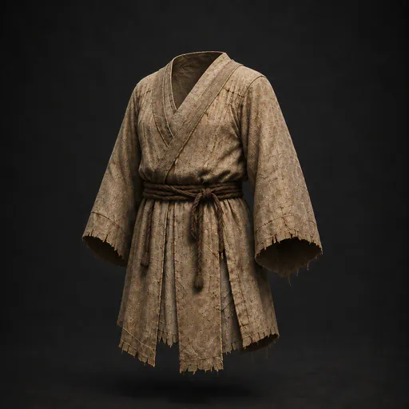</a></td>
      <td align="center"><a href="assets/equipment/approved/material-equipment-v1/items/f/hemp-weave/robes-legs.png">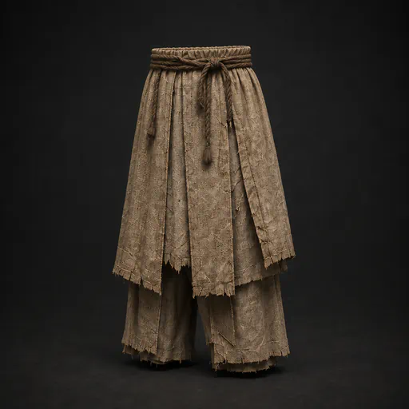</a></td>
      <td align="center"><a href="assets/equipment/approved/material-equipment-v1/items/f/hemp-weave/robes-boots.png">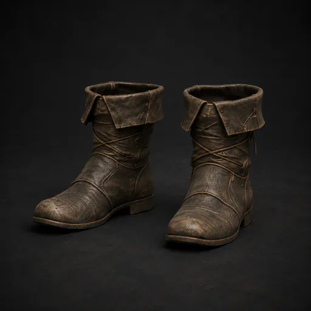</a></td>
    </tr>
    <tr><th scope="row">Layered Silk<br>Rank D</th>
      <td align="center"><a href="assets/equipment/approved/material-equipment-v1/items/d/ironwood/staff.png">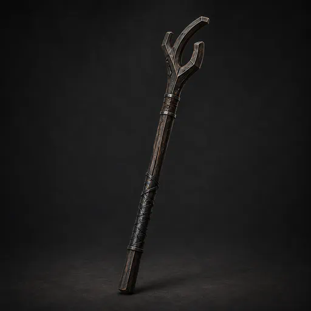</a><br>Ironwood Staff</td>
      <td align="center"><a href="assets/equipment/approved/material-equipment-v1/items/d/layered-silk/robes-head.png">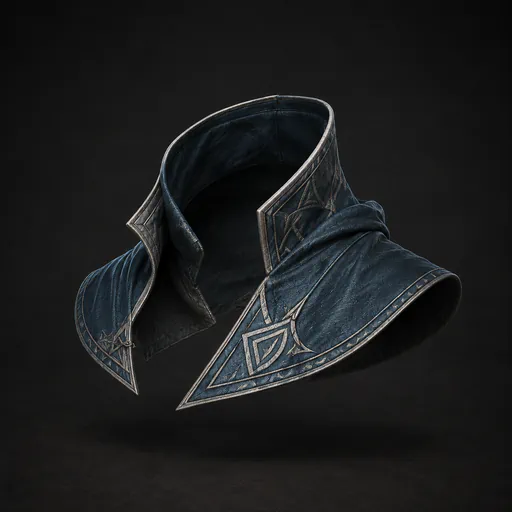</a></td>
      <td align="center"><a href="assets/equipment/approved/material-equipment-v1/items/d/layered-silk/robes-torso.png">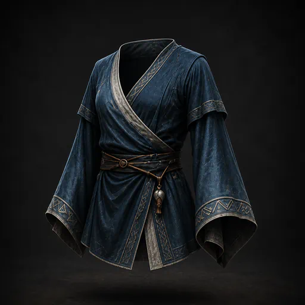</a></td>
      <td align="center"><a href="assets/equipment/approved/material-equipment-v1/items/d/layered-silk/robes-legs.png">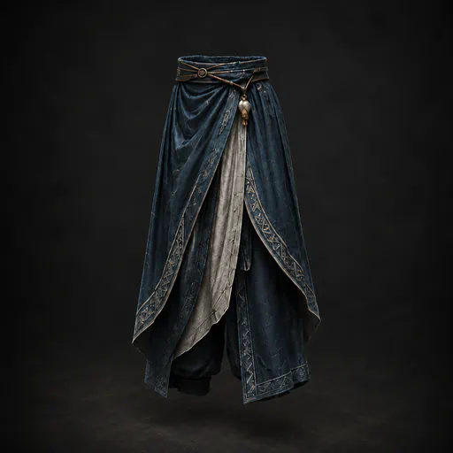</a></td>
      <td align="center"><a href="assets/equipment/approved/material-equipment-v1/items/d/layered-silk/robes-boots.png">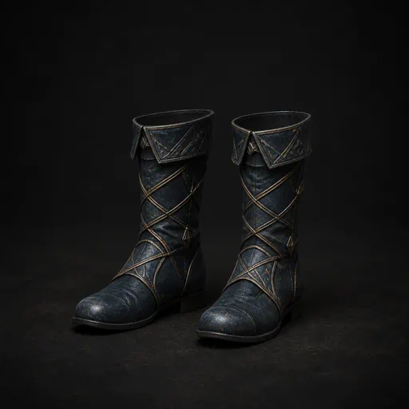</a></td>
    </tr>
    <tr><th scope="row">Fateweave<br>Rank S</th>
      <td align="center"><a href="assets/equipment/approved/material-equipment-v1/items/s/worldtree-limb/staff.png">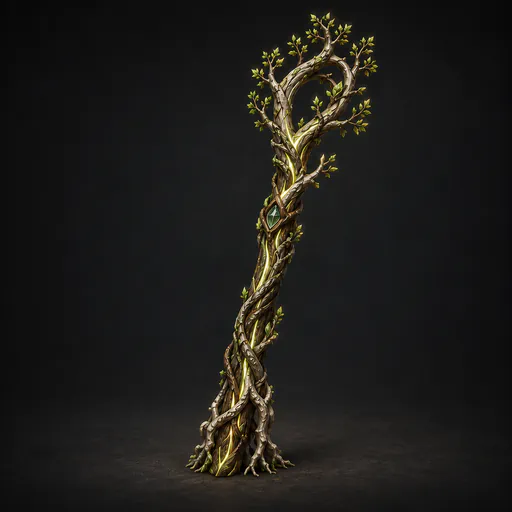</a><br>Worldtree Limb Staff</td>
      <td align="center"><a href="assets/equipment/approved/material-equipment-v1/items/s/fateweave/robes-head.png">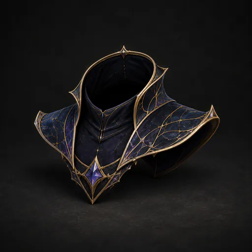</a></td>
      <td align="center"><a href="assets/equipment/approved/material-equipment-v1/items/s/fateweave/robes-torso.png">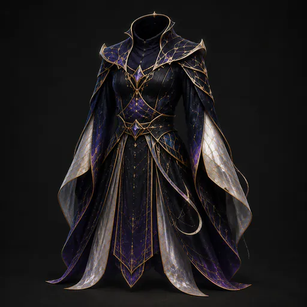</a></td>
      <td align="center"><a href="assets/equipment/approved/material-equipment-v1/items/s/fateweave/robes-legs.png">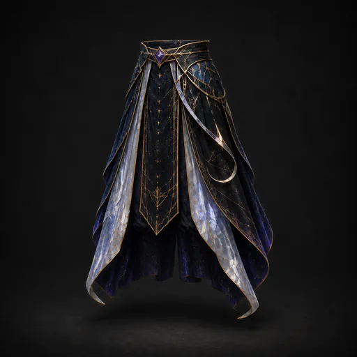</a></td>
      <td align="center"><a href="assets/equipment/approved/material-equipment-v1/items/s/fateweave/robes-boots.png">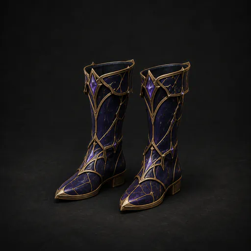</a></td>
    </tr>
  </tbody>
</table>

*Select any image to open its full-size artwork.*

Preparation connects the village to the expedition. Weapons, armor, materials, and rank progression
give the Forge a place in the larger story. A complete set gives each hero tools suited to the work
ahead, while supplies, training, and recovery help a party use those tools well.

## Skills

<table>
  <tbody>
    <tr><th colspan="4">Combat</th></tr>
    <tr>
      <td align="center" width="25%"><a href="assets/wiki/skills/icon-production-v2/interiors/martial-blade-measured-cut.png">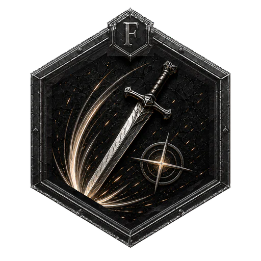</a><br><strong>Measured Cut</strong></td>
      <td align="center" width="25%"><a href="assets/wiki/skills/icon-production-v2/interiors/martial-ranged-aimed-shot.png">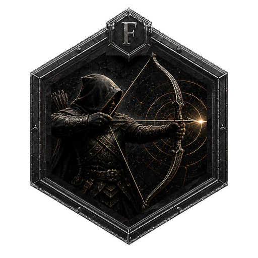</a><br><strong>Aimed Shot</strong></td>
      <td align="center" width="25%"><a href="assets/wiki/skills/icon-production-v2/interiors/magical-elemental-fireball.png">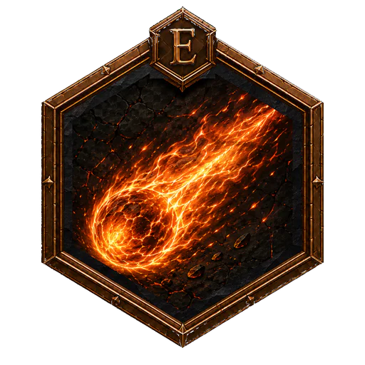</a><br><strong>Fireball</strong></td>
      <td align="center" width="25%"><a href="assets/wiki/skills/icon-production-v2/interiors/martial-shield-shield-bash.png">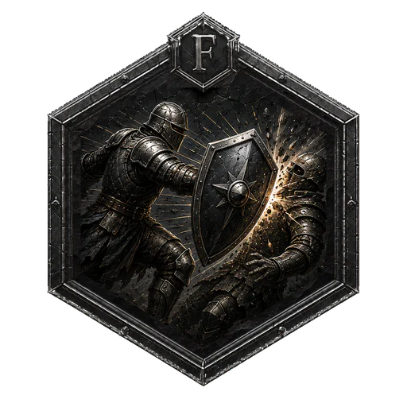</a><br><strong>Shield Bash</strong></td>
    </tr>
    <tr><th colspan="4">Craft</th></tr>
    <tr>
      <td align="center" width="25%"><a href="assets/wiki/skills/icon-production-v2/interiors/craft-forging-weaponsmithing.png">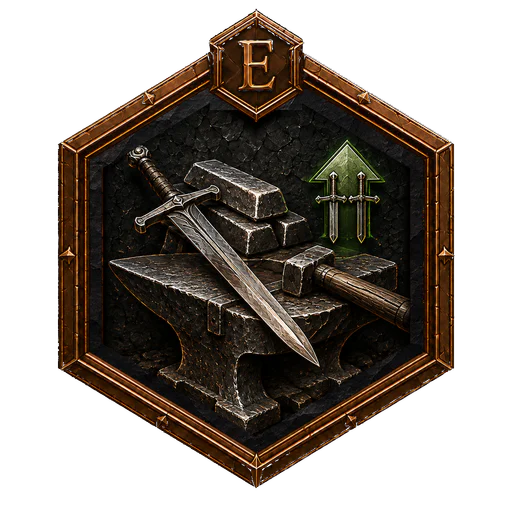</a><br><strong>Weaponsmithing</strong></td>
      <td align="center" width="25%"><a href="assets/wiki/skills/icon-production-v2/interiors/craft-alchemy-potion-brewing.png">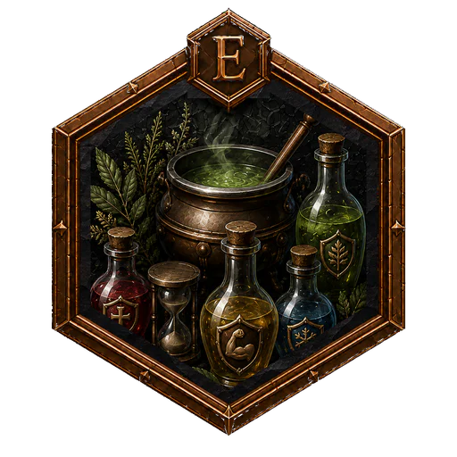</a><br><strong>Potion Brewing</strong></td>
      <td align="center" width="25%"><a href="assets/wiki/skills/icon-production-v2/interiors/craft-cooking-hearth-meal.png">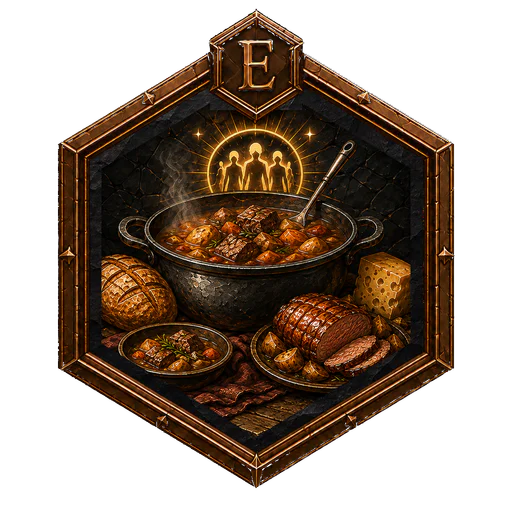</a><br><strong>Hearth Meal</strong></td>
      <td align="center" width="25%"><a href="assets/wiki/skills/icon-production-v2/interiors/craft-gathering-mining.png">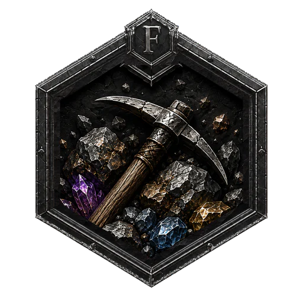</a><br><strong>Mining</strong></td>
    </tr>
    <tr><th colspan="4">Social and knowledge</th></tr>
    <tr>
      <td align="center" width="25%"><a href="assets/wiki/skills/icon-production-v2/interiors/craft-knowledge-languages.png">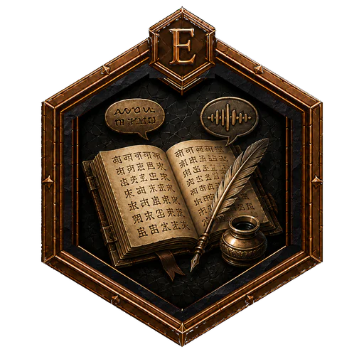</a><br><strong>Languages</strong></td>
      <td align="center" width="25%"><a href="assets/wiki/skills/icon-production-v2/interiors/magical-mind-presence.png">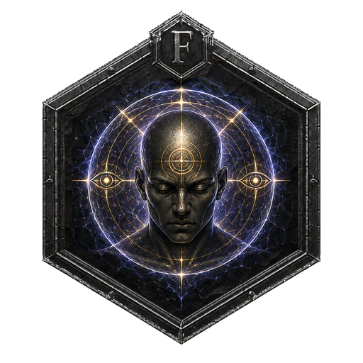</a><br><strong>Presence</strong></td>
      <td align="center" width="25%"><a href="assets/wiki/skills/icon-production-v2/interiors/magical-mind-read-surface.png">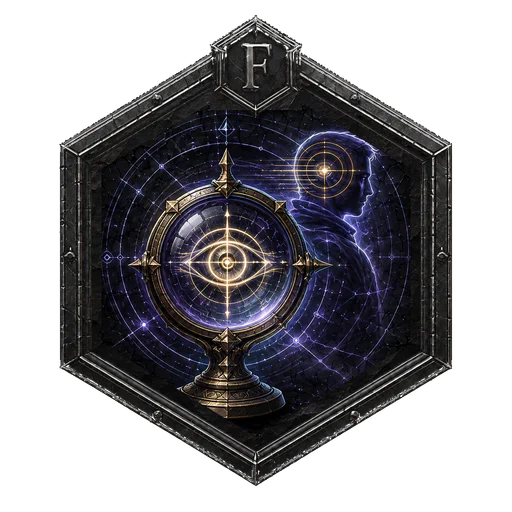</a><br><strong>Read Surface</strong></td>
      <td align="center" width="25%"><a href="assets/wiki/skills/icon-production-v2/interiors/craft-knowledge-research.png">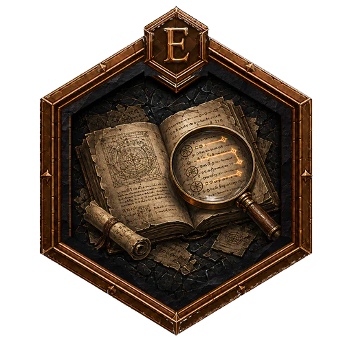</a><br><strong>Research</strong></td>
    </tr>
    <tr><th colspan="4">Support</th></tr>
    <tr>
      <td align="center" width="25%"><a href="assets/wiki/skills/icon-production-v2/interiors/magical-restoration-mending.png">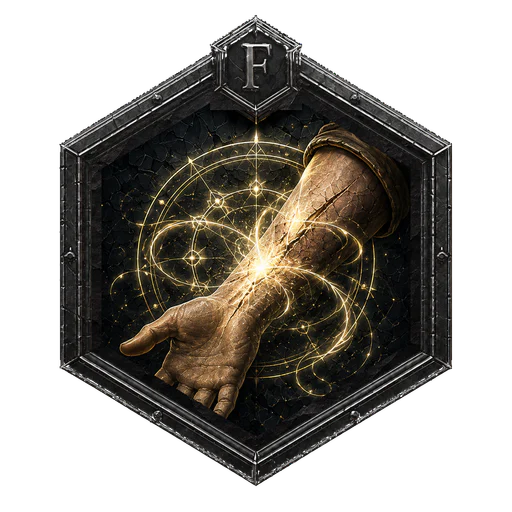</a><br><strong>Mending</strong></td>
      <td align="center" width="25%"><a href="assets/wiki/skills/icon-production-v2/interiors/magical-enchantment-group-blessing.png">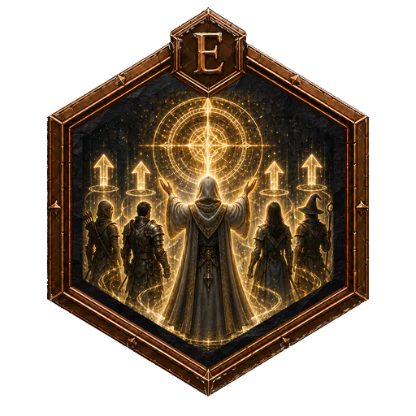</a><br><strong>Group Blessing</strong></td>
      <td align="center" width="25%"><a href="assets/wiki/skills/icon-production-v2/interiors/magical-restoration-soothe.png">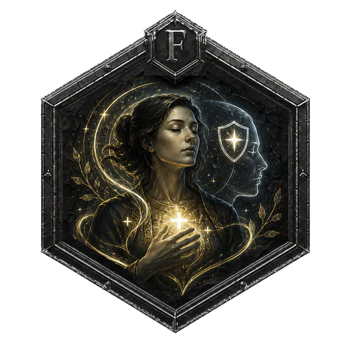</a><br><strong>Soothe</strong></td>
      <td align="center" width="25%"><a href="assets/wiki/skills/icon-production-v2/interiors/magical-ward-barrier.png">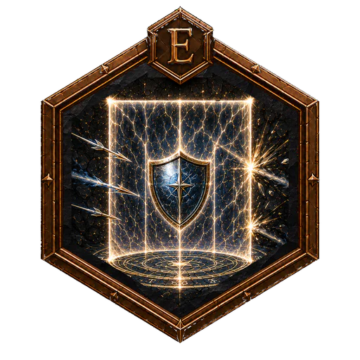</a><br><strong>Barrier</strong></td>
    </tr>
  </tbody>
</table>

*Select any image to open its full-size artwork.*

Skills grow through meaningful practice. Fighting, making, learning, teaching, and supporting others
all give a hero ways to contribute. The intended system connects what a person does each day with
what they become capable of doing next.

The long story is the history of a Hearth: who you welcomed, what they became, what you asked of
them, and how the town changed. Reaching Floor 100 gives the campaign a destination. The people give
it a reason to matter.

The sections above describe the intended experience. This repository preserves the prototype,
approved artwork, experiments, and broader design; implementation coverage is recorded in the
[release roadmap](docs/wiki/roadmap/README.md) and [implementation progress](docs/progress.md).

<details>
<summary>Run the prototype locally</summary>

Requires Node `24.19.0` (pinned in `.node-version`) and pnpm `10.33.0`.
Source artwork uses Git LFS; install Git LFS before cloning, or run `git lfs pull` in an existing clone.

```sh
pnpm install
pnpm dev:app
```

Open `http://localhost:5173`. This lightweight mode does not require Docker; database-backed
features report PostgreSQL as unavailable. For the complete stack, including PostgreSQL and
migrations, run `pnpm dev` with Docker available.

```sh
pnpm check     # full repository validation
pnpm test:e2e  # browser tests
pnpm db:stop   # stop local PostgreSQL
```

[Game wiki](docs/wiki/README.md) · [System architecture](docs/system-architecture/README.md) ·
[Web application and deployment](apps/web/README.md)

</details>

---

**Archive notice:** The website is no longer available, and development is paused for now.
This repository preserves Summonlab's prototype, artwork, and intended game design.
